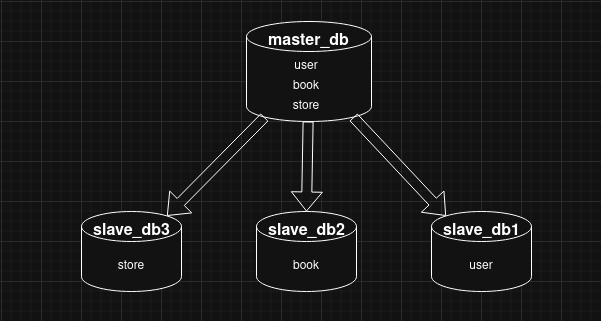
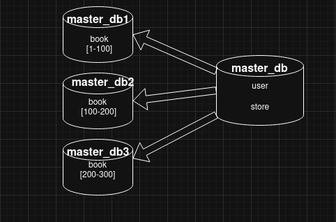

# Домашнее задание к занятию "`Репликация и масштабирование. Часть 2`" - `Шмагин Максим`


### Задание 1.

```
Опишите основные преимущества использования масштабирования методами:

    активный master-сервер и пассивный репликационный slave-сервер;
    master-сервер и несколько slave-серверов;

Дайте ответ в свободной форме.
```

Ответ:


**Активный master + пассивный slave** — преимущества

    - Простота: одна записьная нода и одна реплика — легко настраивать и управлять.
    - Высокая готовность: реплика готова к промоции при отказе мастера.
    - Безопасные бэкапы/тесты: реплика используется для резервных копий и проверок без нагрузки на мастер.
    - Меньше проблем с согласованностью и отставанием.

**Master + несколько slave** — преимущества

    - Масштабирование чтений: распределение SELECT‑запросов между репликами.
    - Повышенная отказоустойчивость: падение одной реплики не критично.
    - Геораспределение: снижение задержек для пользователей в разных регионах.
    - Возможность разделять роли (бэкап, аналитика, тестирование) без влияния на мастер.

Вывод: один пассивный slave — простая HA и безопасные бэкапы; несколько slave — масштабирование чтений, лучшая отказоустойчивость и геораспределённость.


### Задание 2.


```
Разработайте план для выполнения горизонтального и вертикального шаринга базы данных. База данных состоит из трёх таблиц:

    пользователи,
    книги,
    магазины (столбцы произвольно).

Опишите принципы построения системы и их разграничение или разбивку между базами данных.

Пришлите блоксхему, где и что будет располагаться. Опишите, в каких режимах будут работать сервера.
```

Ответ:

Вертикальное масштабирование (масштабирование вверх) — способ повысить производительность за счёт увеличения ресурсов (CPU, ОЗУ, дискового пространства) у существующего сервера или машины.
Подразумеваем, что на каждую таблицу базы данных приходится большая нагрузка на чтение.



Преимущества:

    - Простота внедрения — не требует серьёзных изменений в архитектуре приложения или сложной настройки кластера.
    - Отсутствие дополнительных лицензионных расходов — при апгрейде обычно сохраняются действующие лицензии на ПО.
    - Меньше операционной сложности — не растёт число физических или виртуальных машин для управления.
    - Ускорение работы без переработки архитектуры — хорошо подходит для приложений, которые не рассчитаны на распределённую обработку.

Недостатки:

    - Физические ограничения — есть верхний предел улучшения одного сервера (максимум CPU, объём RAM и т.д.), после которого масштабирование невозможно.
    - Возможные простои — обновление «железа» на физических серверах часто требует временного отключения.
    - Высокая стоимость — мощные серверы и современные компоненты могут быть дорогими.
    - Отсутствие отказоустойчивости — при наличии только одного мощного узла его выход из строя может привести к полной недоступности сервиса.

Горизонтальное масштабирование — способ увеличения вычислительной мощности путём добавления новых серверов или узлов вместо наращивания ресурсов одного сервера. Аналогия — «размазывание» данных по нескольким машинам с помощью репликации и выделения slave-серверов для чтения.
Предположим, это база данных интернет-магазина с большим количеством книг; данные настолько объёмны, что не помещаются на одном сервере, поэтому таблицу book распределим по нескольким серверам.



Преимущества:

    - Надёжность и отказоустойчивость — при выходе из строя одного узла система может продолжать работу за счёт перераспределения запросов на другие узлы.
    - Эластичность и масштабируемость — можно добавлять ресурсы по необходимости без остановки сервиса.
    - Экономичность — зачастую выгоднее приростить количество стандартных машин, чем модернизировать один дорогой сервер.
    - Повышение производительности — распределение нагрузки между узлами сокращает время отклика.
    - Гибкость развёртывания — легко включать или отключать мощности в зависимости от спроса.

Недостатки:

    - Сложность настройки и поддержки — требуется дополнительное ПО для балансировки нагрузки, синхронизации и виртуализации.
    - Проблемы согласованности данных — разные узлы могут обслуживать разные запросы, что усложняет синхронизацию состояния.
    - Требования к балансировке — оптимально, когда добавленные узлы имеют сопоставимую мощность; иначе при отказе могут возникать узкие места.
    - Усложнённое управление состоянием — данные должны быть доступны всем узлам; часто используют распределённые СУБД или кэши.
    - Сетевые задержки между узлами — могут влиять на производительность; размещение связанных сервисов в одном регионе и оптимизация сети помогают снизить эффект.
